[](https://plugins.jenkins.io/visualexpert)
[](https://plugins.jenkins.io/visualexpert)

# Visual Expert Jenkins Plugin

The Visual Expert Jenkins plugin automates project analysis, code inspection reports, and documentation generation from Jenkins builds.

Use the Visual Expert build step to:

- Analyze an existing Visual Expert project.
- Generate reference documentation or code review documentation.
- Generate a **CodeRule Based** report in **JUNIT** format.
- Generate a **DefectSummary Based** report in **JSON** or **XML** format.

## Getting started

### Configure the Visual Expert installation

1. Install the **Visual Expert** plugin in Jenkins.
2. Go to **Manage Jenkins → Tools → Visual Expert**.
3. Configure the installation path to the folder containing the Visual Expert Console.CommandLine executable.
4. Click **Apply**, then **Save**.

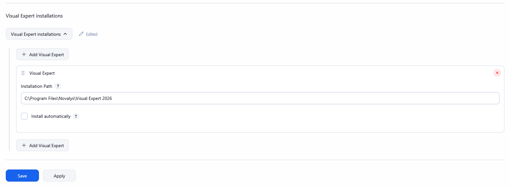

### Add a Visual Expert build step

1. Open your Freestyle job and click **Configure**.
2. Under **Build Steps**, select **Add build step → Visual Expert**.
3. Select an existing Visual Expert project from the project dropdown.
4. Enable the operations you want to run: project analysis, reference documentation, code review documentation, or code inspection report generation.
5. Configure the report settings if report generation is enabled.
6. Save the job configuration.

The project dropdown lists Visual Expert projects configured on the local system. Ensure that the Jenkins account can access the selected project, Visual Expert installation, and report output folder.

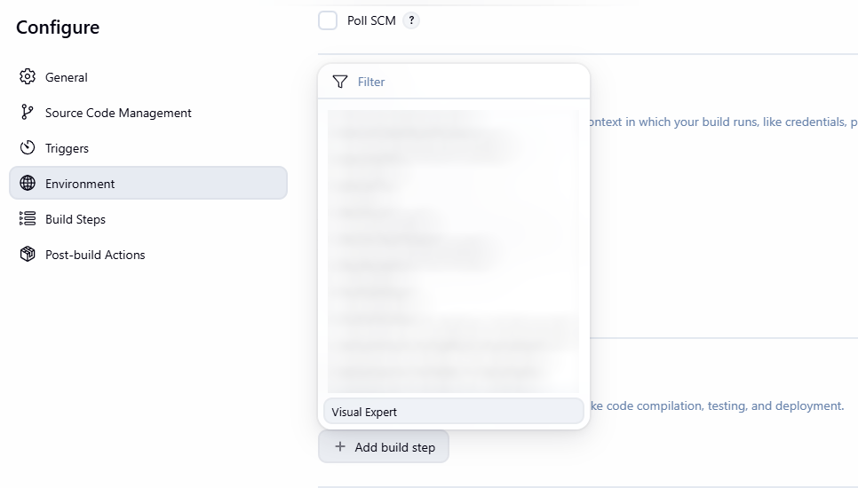

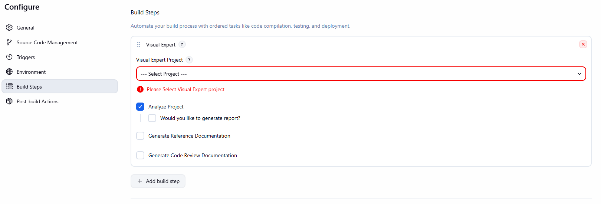

## Generate code inspection reports

Enable **Generate code inspection report**, specify the report output path, and select a **Report Type**. The **Report Format** dropdown updates to show the formats supported by that report type.

| Report Type | Available Report Formats | Usage |
| --- | --- | --- |
| CodeRule Based | JUNIT | Publish code rule results using Jenkins JUnit reporting. |
| DefectSummary Based | JSON, XML | Process defect summary data for reporting, charts, or custom build checks. |

### CodeRule Based report

1. Select **CodeRule Based** as the report type.
2. Select **JUNIT** as the report format.
3. Specify an output file path with an `.xml` extension.
4. In Visual Expert, open **Project Settings → Code Inspection** and select the appropriate Code Review Profile.

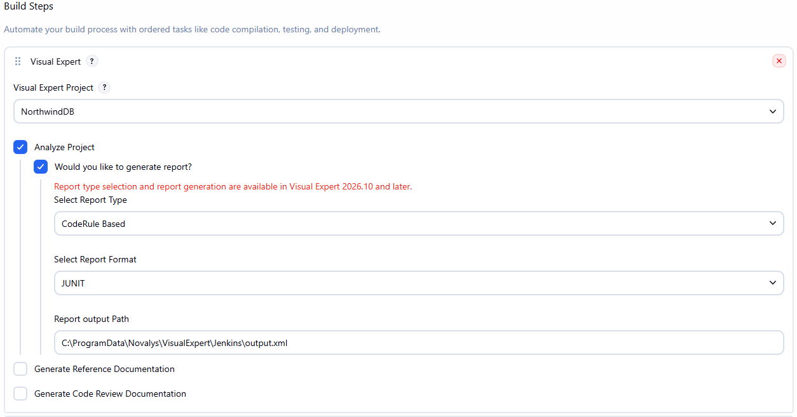

The selected profile determines the code rule success and failure criteria used in the report.

### DefectSummary Based report

1. Select **DefectSummary Based** as the report type.
2. Select **JSON** or **XML** as the report format.
3. Specify an output file path matching the selected format, such as `output.json` or `output.xml`.

Use the generated report as input for downstream processing, such as extracting active and new issue counts, creating trend charts, or checking custom issue thresholds. Configure those processing and publishing steps separately in the Jenkins job.

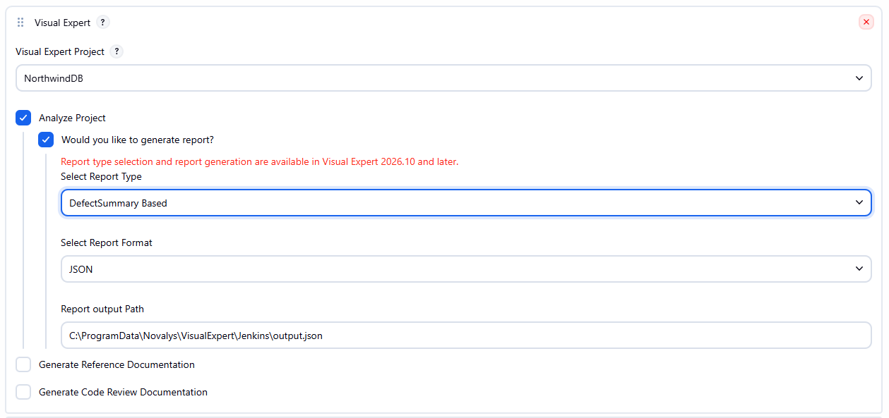

## Run the build

Run the job and open **Console Output** to review the Visual Expert operations and generated report location.

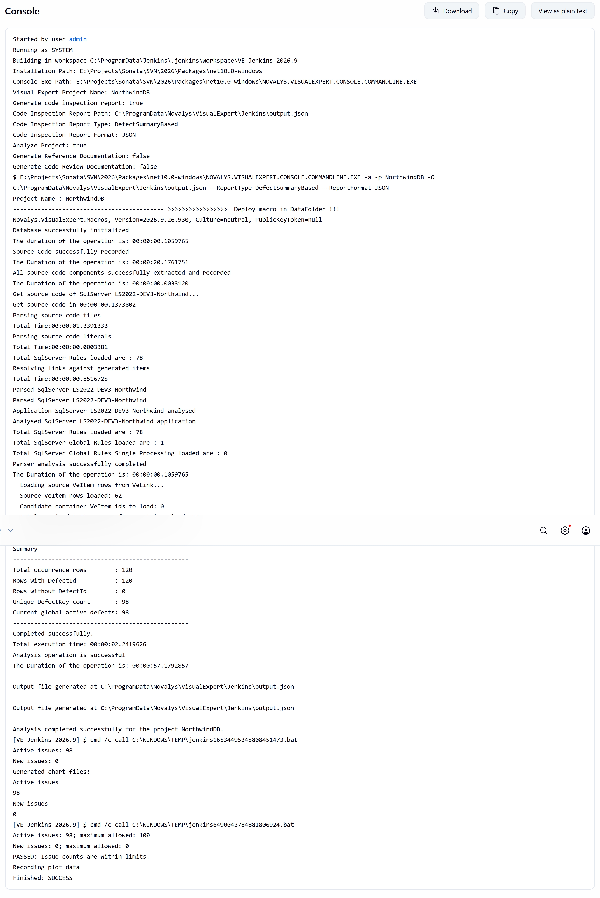

## Publish JUnit results

For **CodeRule Based** reports generated in **JUNIT** format:

1. Ensure the Jenkins [JUnit plugin](https://plugins.jenkins.io/junit/) is installed.
2. Generate the JUnit XML report inside the build workspace, or copy it there in a subsequent build step.
3. In the job configuration, select **Add post-build action → Publish JUnit test result report**.
4. Set **Test report XMLs** to the report path relative to the workspace, for example `reports/visualexpert-junit.xml`.
5. Save the configuration and run the job.

Jenkins can then display the published results and their history. With the default JUnit publisher settings, reported test failures mark the build as **UNSTABLE**.

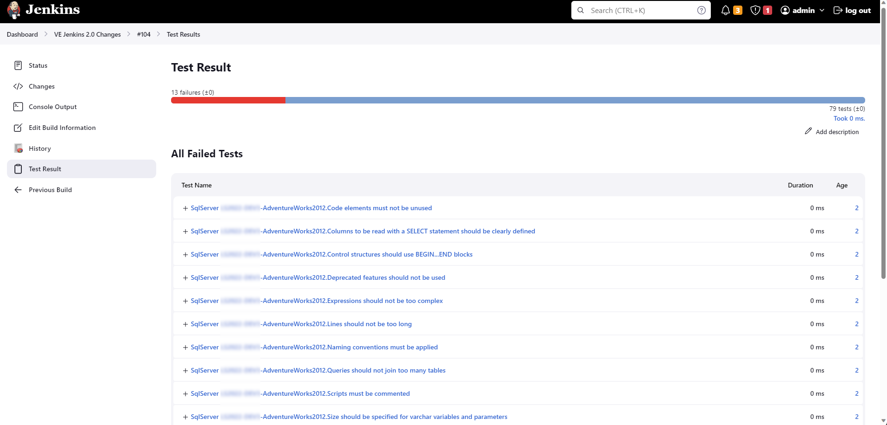

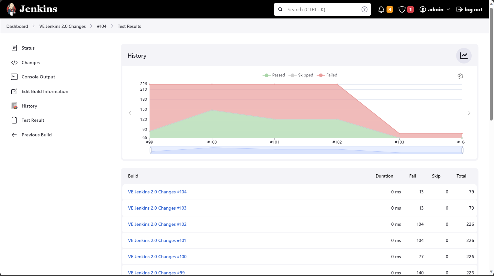

## Plot defect trends and enforce issue thresholds

For **DefectSummary Based** reports, use the generated data to plot defect trends and optionally fail the build when issue counts exceed your limits.

The examples below use **JSON** reports. XML reports require a separate XML parsing step or an XML data series configured with XPath in the Plot plugin; the JSON commands below cannot process XML.

### 1. Generate the JSON report

Select **DefectSummary Based** and **JSON** in the Visual Expert build step. Ensure that the report is generated before the processing steps below.

The commands use `C:\ProgramData\Novalys\VisualExpert\Jenkins\output.json` as an example. Replace `VE_REPORT_PATH` in both commands with your actual report path. The Jenkins account must have permission to read this file and write to the build workspace.

For concurrent builds, use a separate report path for each build to avoid overwriting another build's report. Ensure the report comes from the current build.

### 2. Convert the JSON summary to CSV files

Under **Build Steps**, select **Add build step → Execute Windows batch command** and paste the following command after the Visual Expert build step.

It reads `summary.activeDefects` and `summary.newDefects` and creates `ve-active.csv` and `ve-new.csv` in the build workspace. Each file contains a column heading followed by its issue count.

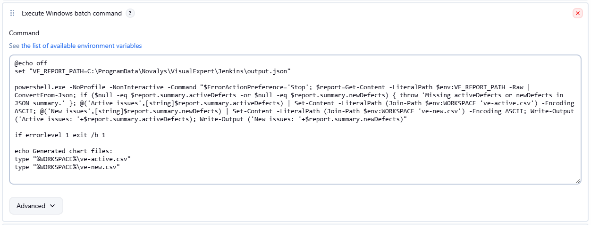

```bat
@echo off
set "VE_REPORT_PATH=C:\ProgramData\Novalys\VisualExpert\Jenkins\output.json"

powershell.exe -NoProfile -NonInteractive -Command "$ErrorActionPreference='Stop'; $report=Get-Content -LiteralPath $env:VE_REPORT_PATH -Raw | ConvertFrom-Json; if ($null -eq $report.summary.activeDefects -or $null -eq $report.summary.newDefects) { throw 'Missing activeDefects or newDefects in JSON summary.' }; @('Active issues',[string]$report.summary.activeDefects) | Set-Content -LiteralPath (Join-Path $env:WORKSPACE 've-active.csv') -Encoding ASCII; @('New issues',[string]$report.summary.newDefects) | Set-Content -LiteralPath (Join-Path $env:WORKSPACE 've-new.csv') -Encoding ASCII; Write-Output ('Active issues: '+$report.summary.activeDefects); Write-Output ('New issues: '+$report.summary.newDefects)"

if errorlevel 1 exit /b 1

echo Generated chart files:
type "%WORKSPACE%\ve-active.csv"
type "%WORKSPACE%\ve-new.csv"
```

### 3. Optionally fail the build when issue limits are exceeded

Add another **Execute Windows batch command** step after the CSV conversion step and paste the following command.

Set `VE_MAX_ACTIVE` and `VE_MAX_NEW` to your permitted issue counts. The example allows up to **100 active issues** and **0 new issues**. A count equal to its limit passes; a count above either limit fails. Omit this step if you only want to plot trends.

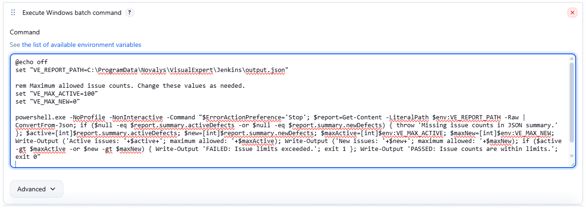

```bat
@echo off
set "VE_REPORT_PATH=C:\ProgramData\Novalys\VisualExpert\Jenkins\output.json"

rem Maximum allowed issue counts. Change these values as needed.
set "VE_MAX_ACTIVE=100"
set "VE_MAX_NEW=0"

powershell.exe -NoProfile -NonInteractive -Command "$ErrorActionPreference='Stop'; $report=Get-Content -LiteralPath $env:VE_REPORT_PATH -Raw | ConvertFrom-Json; if ($null -eq $report.summary.activeDefects -or $null -eq $report.summary.newDefects) { throw 'Missing issue counts in JSON summary.' }; $active=[int]$report.summary.activeDefects; $new=[int]$report.summary.newDefects; $maxActive=[int]$env:VE_MAX_ACTIVE; $maxNew=[int]$env:VE_MAX_NEW; Write-Output ('Active issues: '+$active+'; maximum allowed: '+$maxActive); Write-Output ('New issues: '+$new+'; maximum allowed: '+$maxNew); if ($active -gt $maxActive -or $new -gt $maxNew) { Write-Output 'FAILED: Issue limits exceeded.'; exit 1 }; Write-Output 'PASSED: Issue counts are within limits.'; exit 0"

exit /b %ERRORLEVEL%
```

This command returns exit code `1` when either limit is exceeded or the report cannot be processed, causing the Windows batch build step to fail. It returns `0` when both counts are within the limits. These checks use the defect-summary counts, independently of JUnit results.

### 4. Configure the trend plot

1. Ensure the Jenkins [Plot plugin](https://plugins.jenkins.io/plot/) is installed.
2. Under **Post-build Actions**, select **Add post-build action → Plot build data**.
3. Configure a plot with a title such as **Defect Trend** and a Y-axis label such as **Issue count**.
4. Add two **CSV** data series with source paths relative to the workspace: `ve-active.csv` and `ve-new.csv`.
5. To display builds whose issue counts are zero, leave **Exclude zero** disabled.
6. Save the configuration and run the job.

The source CSV files provide the current build's counts. The Plot plugin maintains the history across builds in its own CSV file; do not use that history file as the source data series.

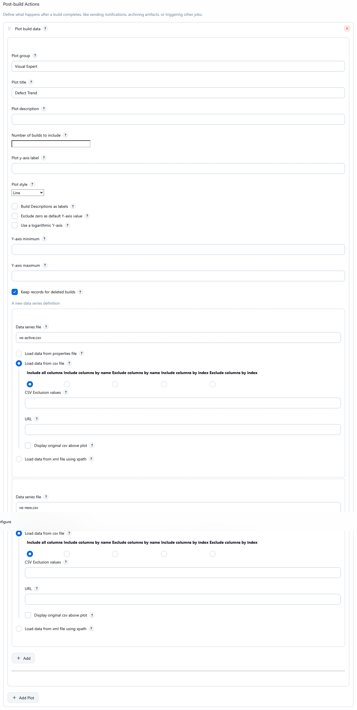

### 5. Review the build results

Review **Console Output** for the extracted counts and threshold-check result, and open the plot to view trends across builds.

**Passed build**

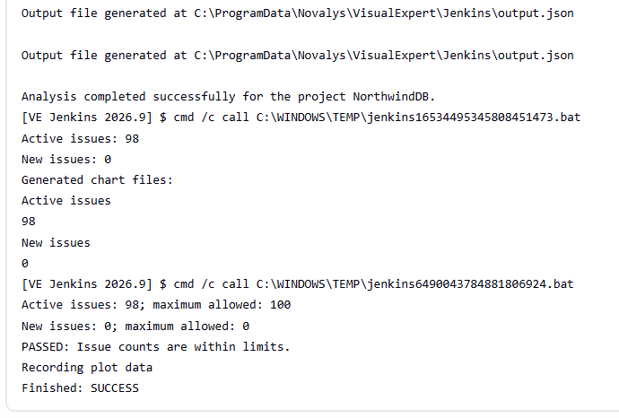

**Failed build**

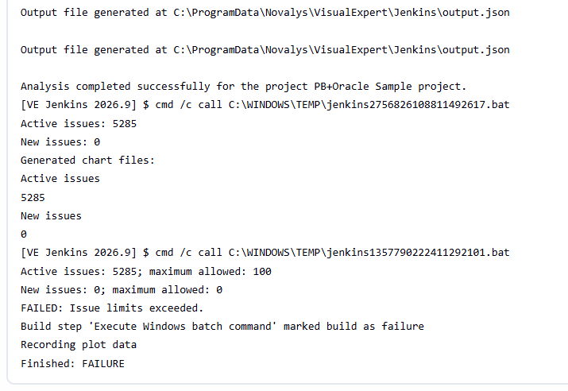

**Defect trend**

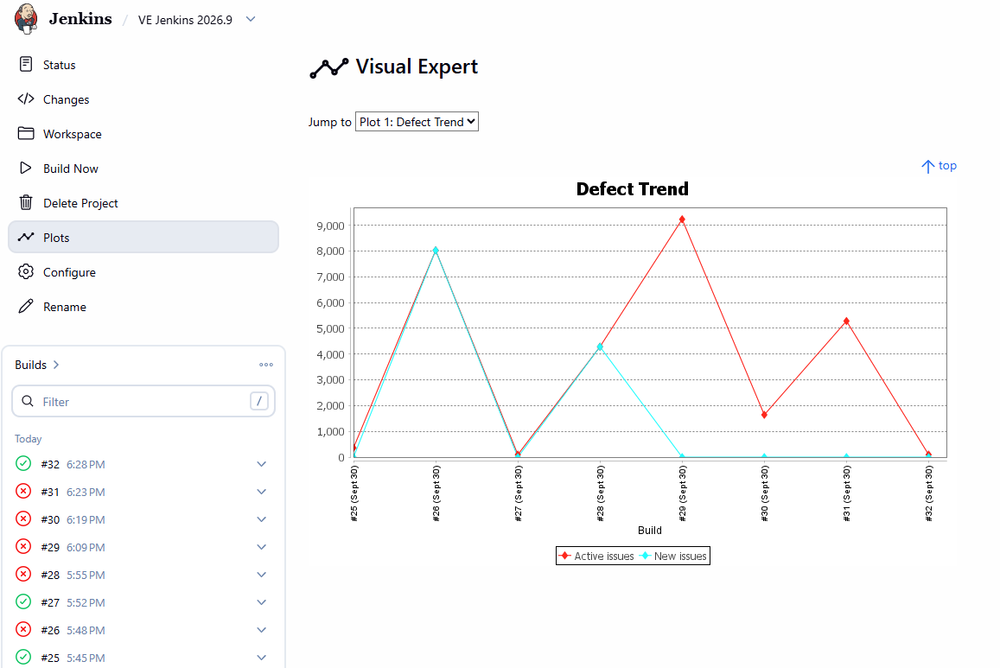

## License

Licensed under the GNU General Public License, version 2. See [LICENSE](LICENSE.md).

